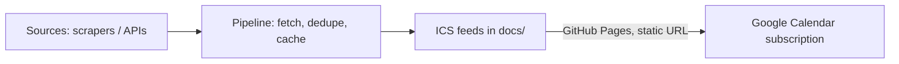

# City Calendar

An open, subscribable calendar of flea markets, exhibitions, museum free days
and other events — starting with two regions: Copenhagen (incl. Greater
Copenhagen and notable Odense/Malmo events) and Leuven (incl. Brussels and
nearby areas). Subscribe in Google Calendar once, keep getting updates
forever, no account needed.

## How it works



1. Each **source** (`src/citycalendar/sources/`) fetches events from a site or API.
2. The **pipeline** (`src/citycalendar/pipeline.py`) runs every enabled source,
   falls back to the last good cache if a source breaks, dedupes events, and
   writes `.ics` files to `docs/`.
3. `docs/` is published with **GitHub Pages**, giving each feed a stable URL.
4. A scheduled **GitHub Action** re-runs the pipeline and commits refreshed
   feeds, so anyone who subscribed keeps getting updates automatically.

## Feeds

| File | Contents |
| --- | --- |
| `docs/all.ics` | Every event from every source |
| `docs/copenhagen.ics` | Copenhagen region (Greater Copenhagen, notable Odense/Malmo events) |
| `docs/leuven.ics` | Leuven region (Leuven, Brussels, nearby areas) |
| `docs/flea-market.ics` | 🧺 Flea markets, across all regions |
| `docs/exhibition.ics` | 🖼️ Exhibitions, across all regions |
| `docs/museum-free-day.ics` | 🏛️ Museum free days, across all regions |
| `docs/event.ics` | 🎫 General events, across all regions |

Subscribe in Google Calendar: **Settings → Add calendar → From URL**, using the
GitHub Pages URL of one of the files above. Mix and match — e.g. subscribe to both
`leuven.ics` and `flea-market.ics` if you only care about Leuven-area markets plus
every region's flea markets.

## Categories

Flea market, exhibition, museum free day, and general event — set per source and
tagged on each event's `CATEGORIES` field. Each event's title is also prefixed with
a category emoji (🧺 🖼️ 🏛️ 🎫) so they're easy to spot at a glance even in the
combined `all.ics`/region feeds, since most calendar clients don't expose per-event
coloring from a subscribed ICS feed.

## Project layout

```
config/sources.yaml              registry of enabled sources
src/citycalendar/models.py       Event, City, Category
src/citycalendar/sources/        one module per data source (extend here)
src/citycalendar/pipeline.py     orchestrates fetch -> dedupe -> build
src/citycalendar/ics_builder.py  builds the .ics files
data/cache/                      last-known-good data per source (robustness)
docs/                            generated feeds, served by GitHub Pages
```

## Adding a new source or city

1. Create `src/citycalendar/sources/<name>.py` with a class extending `BaseSource`
   and implementing `fetch() -> list[Event]`.
2. Register it in `config/sources.yaml` with its module, class, and params.
3. If it needs a city not yet in `models.City`, add it there and map it to a
   feed name in `ics_builder._FEED_BY_CITY`.

A source only needs to raise on failure — `BaseSource.collect()` already
handles logging and falling back to cached data, so one broken scraper never
takes down the whole feed.

## Current sources

- **Visit Leuven calendar** (`sources/leuven_calendar.py`) — real, working. Scrapes the
  public [visitleuven.be/en/calendar](https://www.visitleuven.be/en/calendar) page. No
  registration or API key needed.
- **Brussels agenda** (`sources/brussels_agenda.py`) — real, working. Scrapes the public
  [brussels.be/agenda](https://www.brussels.be/agenda) page, which conveniently publishes
  category tags per event. No registration or API key needed.
- **UiTdatabank** (`sources/uitdatabank.py`) — optional, disabled by default. A richer,
  official alternative covering all of Flanders & Brussels via publiq's Search API, but
  requires registering a free integration at [platform.publiq.be](https://platform.publiq.be/)
  (pick "UiTdatabank Search API") and setting the client id as `UITDATABANK_CLIENT_ID`.
  Enable it in `config/sources.yaml` if you want broader coverage later.
- **Kultunaut** (`sources/kultunaut_denmark.py`) — real, working. Scrapes
  [kultunaut.dk](https://www.kultunaut.dk/), Denmark's main public cultural events database.
  One instance covers Greater Copenhagen (`Area=Storkøbenhavn`), another pulls a small,
  capped set of top-rated highlights from Odense. No registration or API key needed.
  Note: Kultunaut is Denmark-only, so Malmo (Sweden) isn't covered — that would need a
  separate Swedish source.

## Local development

```bash
pip install -e ".[dev]"
python -m citycalendar.cli   # builds docs/*.ics from config/sources.yaml
pytest
```

## One-time repo setup (once pushed to GitHub)

- Enable GitHub Pages, serving from the `docs/` folder on `main`.
- No secrets are required for the default sources. If you later enable UiTdatabank,
  also add `UITDATABANK_CLIENT_ID` as a repository secret.

## Backlog (grooming notes)

- [x] Core model + extensible source interface
- [x] Robust pipeline (cache fallback, dedupe, per-city + combined feeds)
- [x] GitHub Actions: scheduled rebuild + test workflow
- [x] Real, no-signup sources for Leuven and Brussels (public agenda scrapers)
- [x] Real, no-signup source for Copenhagen + Odense highlights (Kultunaut)
- [ ] Find/add a Swedish source for Malmo highlights
- [ ] Category detection is keyword-based (Brussels has real tags) — revisit if it's too noisy
- [ ] Nicer `docs/index.html` (search/filter, webcal:// buttons)

## License

MIT — see [LICENSE](LICENSE).
