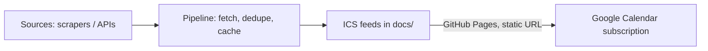

# City Calendar

An open, subscribable calendar of flea markets, exhibitions, museum free days
and other events — starting with two regions: Copenhagen (incl. Greater
Copenhagen and notable Odense/Malmo events) and Leuven (incl. Brussels and
nearby areas). Subscribe in Google Calendar once, keep getting updates
forever, no account needed.

## How it works



1. Each **source** (`src/citycalendar/sources/`) fetches events from a site or API.
2. The **pipeline** (`src/citycalendar/pipeline.py`) runs every enabled source,
   falls back to the last good cache if a source breaks, dedupes events, and
   writes `.ics` files to `docs/`.
3. `docs/` is published with **GitHub Pages**, giving each feed a stable URL.
4. A scheduled **GitHub Action** re-runs the pipeline and commits refreshed
   feeds, so anyone who subscribed keeps getting updates automatically.

## Feeds

Just two feeds, one per region. Categories aren't split into separate feeds —
instead every event's title is prefixed with a category emoji, so you can tell
flea markets/exhibitions/museum free days/general events apart at a glance
within a single region feed.

| File | Contents |
| --- | --- |
| `docs/copenhagen.ics` | Copenhagen region (Greater Copenhagen, notable Odense/Malmo events) |
| `docs/leuven.ics` | Leuven region (Leuven, Brussels, nearby areas) |

Subscribe in Google Calendar: **Settings → Add calendar → From URL**, using the
GitHub Pages URL of one of the files above.

## Categories

Flea market (🧺), exhibition (🖼️), museum free day (🏛️), and general event (🎫) —
set per source and tagged on each event's `CATEGORIES` field, and also prefixed
onto the event title as an emoji, since most calendar clients don't expose
per-event coloring or filtering from a subscribed ICS feed.

## Project layout

```
config/sources.yaml              registry of enabled sources
src/citycalendar/models.py       Event, City, Category
src/citycalendar/sources/        one module per data source (extend here)
src/citycalendar/pipeline.py     orchestrates fetch -> dedupe -> build
src/citycalendar/ics_builder.py  builds the .ics files
data/cache/                      last-known-good data per source (robustness)
docs/                            generated feeds, served by GitHub Pages
```

## Adding a new source or city

1. Create `src/citycalendar/sources/<name>.py` with a class extending `BaseSource`
   and implementing `fetch() -> list[Event]`.
2. Register it in `config/sources.yaml` with its module, class, and params.
3. If it needs a region not yet in `models.City`, add it there — `ics_builder.py`
   automatically creates a feed named after the enum value (e.g. `docs/leuven.ics`).

A source only needs to raise on failure — `BaseSource.collect()` already
handles logging and falling back to cached data, so one broken scraper never
takes down the whole feed.

## Current sources

**Leuven region** (Leuven, Brussels, nearby Belgium):

- **Visit Leuven calendar** (`sources/leuven_calendar.py`) — [visitleuven.be/en/calendar](https://www.visitleuven.be/en/calendar)
- **City of Leuven agenda** (`sources/leuven_be_agenda.py`) — [leuven.be/agenda](https://www.leuven.be/agenda)
- **Brussels agenda** (`sources/brussels_agenda.py`) — [brussels.be/agenda](https://www.brussels.be/agenda)
- **Rommelmarktgids** (`sources/rommelmarktgids.py`) — [rommelmarktgids.be](https://www.rommelmarktgids.be/rommelmarkten/leuven/) (dedicated flea-market guide)
- **UiTdatabank** (`sources/uitdatabank.py`) — publiq's Search API; optional, disabled by default (needs a free [platform.publiq.be](https://platform.publiq.be/) client id)

**Copenhagen region** (Greater Copenhagen, Odense, notable events; Malmo not covered yet):

- **Kultunaut** (`sources/kultunaut_denmark.py`) — [kultunaut.dk](https://www.kultunaut.dk/), Denmark's main cultural events database (Copenhagen, Odense highlights, and a flea-market genre filter)
- **Oplevelser i København** (`sources/oplevelser_kbh.py`) — native ICS feed from [oplevelser-i-koebenhavn.dk](https://oplevelser-i-koebenhavn.dk/loppemarkeder-koebenhavn/)'s flea-market listing

All of these are free and need no registration except UiTdatabank (optional).

## Local development

```bash
pip install -e ".[dev]"
python -m citycalendar.cli   # builds docs/*.ics from config/sources.yaml
pytest
```

## One-time repo setup (once pushed to GitHub)

- Enable GitHub Pages, serving from the `docs/` folder on `main`.
- No secrets are required for the default sources. If you later enable UiTdatabank,
  also add `UITDATABANK_CLIENT_ID` as a repository secret.

## License

MIT — see [LICENSE](LICENSE).
