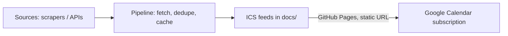

# City Calendar

An open, subscribable calendar of flea markets, exhibitions, museum free days
and other events — starting with Copenhagen and Leuven/Brussels. Subscribe in
Google Calendar once, keep getting updates forever, no account needed.

## How it works



1. Each **source** (`src/citycalendar/sources/`) fetches events from a site or API.
2. The **pipeline** (`src/citycalendar/pipeline.py`) runs every enabled source,
   falls back to the last good cache if a source breaks, dedupes events, and
   writes `.ics` files to `docs/`.
3. `docs/` is published with **GitHub Pages**, giving each feed a stable URL.
4. A scheduled **GitHub Action** re-runs the pipeline and commits refreshed
   feeds, so anyone who subscribed keeps getting updates automatically.

## Feeds

| File | Contents |
| --- | --- |
| `docs/all.ics` | Every event from every source |
| `docs/copenhagen.ics` | Copenhagen only |
| `docs/leuven-brussels.ics` | Leuven & Brussels only |

Subscribe in Google Calendar: **Settings → Add calendar → From URL**, using the
GitHub Pages URL of one of the files above.

## Categories

Flea market, exhibition, museum free day, and general event — set per source
and tagged on each event's `CATEGORIES` field, so you can filter/color them in
your calendar client.

## Project layout

```
config/sources.yaml              registry of enabled sources
src/citycalendar/models.py       Event, City, Category
src/citycalendar/sources/        one module per data source (extend here)
src/citycalendar/pipeline.py     orchestrates fetch -> dedupe -> build
src/citycalendar/ics_builder.py  builds the .ics files
data/cache/                      last-known-good data per source (robustness)
docs/                            generated feeds, served by GitHub Pages
```

## Adding a new source or city

1. Create `src/citycalendar/sources/<name>.py` with a class extending `BaseSource`
   and implementing `fetch() -> list[Event]`.
2. Register it in `config/sources.yaml` with its module, class, and params.
3. If it needs a city not yet in `models.City`, add it there and map it to a
   feed name in `ics_builder._FEED_BY_CITY`.

A source only needs to raise on failure — `BaseSource.collect()` already
handles logging and falling back to cached data, so one broken scraper never
takes down the whole feed.

## Current sources

- **UiTdatabank** (`sources/uitdatabank.py`) — real, working. Covers Leuven and
  Brussels via publiq's public Search API. Needs a free **client id**: register
  an integration for "UiTdatabank Search API" at
  [platform.publiq.be](https://platform.publiq.be/) (free, instant test credentials),
  then set it as the `UITDATABANK_CLIENT_ID` secret/env var. No client secret or
  token is needed — the Search API only requires client identification.
- **Copenhagen** (`sources/copenhagen_template.py`) — template only, disabled by
  default. Good starting points: municipal open data
  ([opendata.dk](https://www.opendata.dk/)) or individual museum/venue sites.

## Local development

```bash
pip install -e ".[dev]"
python -m citycalendar.cli   # builds docs/*.ics from config/sources.yaml
pytest
```

## One-time repo setup (once pushed to GitHub)

- Enable GitHub Pages, serving from the `docs/` folder on `main`.
- Add `UITDATABANK_CLIENT_ID` as a repository secret (used by the scheduled workflow).

## Backlog (grooming notes)

- [x] Core model + extensible source interface
- [x] Robust pipeline (cache fallback, dedupe, per-city + combined feeds)
- [x] GitHub Actions: scheduled rebuild + test workflow
- [ ] Implement a real Copenhagen source
- [ ] Add a Brussels-specific source beyond UiTdatabank (e.g. agenda.brussels)
- [ ] Category detection for UiTdatabank is keyword-based — replace with UiTdatabank's own taxonomy/terms API for accuracy
- [ ] Nicer `docs/index.html` (search/filter, webcal:// buttons)

## License

MIT — see [LICENSE](LICENSE).
